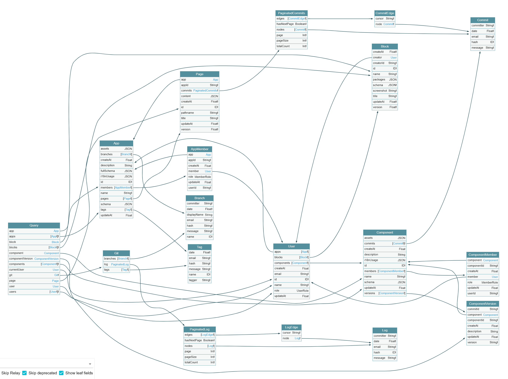
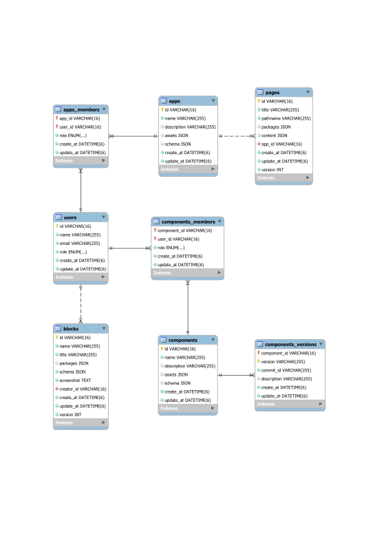

# 云梯低码平台架构设计文档

## 1. 简介和目标

- 简要介绍低码平台的用途和目标。
- 主要面向的人群
- 说明低码平台的优势和主要特点。

## 2. 前端架构

- 介绍前端框架和技术选型（lowcode engine）。
- 描述自定义插件、设置器和组件的设计和实现方式。
- 解释多页面支持的实现方法和全局上下文管理的机制。
- 讨论 Git 提交面板的功能和前后端交互。

## 3. 后端架构

- 简述后端框架和技术选型（Nest.js）。
- 说明采用 GraphQL code first 开发模式的原因和优势。
- 解释 GraphQL Code Generator 在后端开发中的作用和集成方式。
- 讨论后端编写的 GraphQL API 生成 SDK 供前端调用的实现机制。

GraphQL API 实体关系图:

## 4. 数据库架构

- 介绍数据库选型（dolt）的理由和优势。
- 阐述 dolt 数据库版本管理功能在低码平台中的应用和好处。
- 解释低码平台的版本管理功能（commit、branch、tag）是如何与 dolt 数据库集成的。

## 5. 安全性和权限

- 讨论低码平台的安全措施，包括前后端数据传输的加密方式。
- 说明用户权限管理和认证的实现方式，例如使用 JWT（JSON Web Token）。
- 解释如何防止常见的安全威胁，如跨站脚本攻击（XSS）和跨站请求伪造（CSRF）。

## 6. 性能和扩展性

- 讨论低码平台的性能考虑，包括前端页面加载速度和后端 API 响应时间。
- 描述如何进行性能测试和优化，以确保平台的高可用性和稳定性。
- 说明低码平台的扩展性设计，以支持未来的新增功能和用户规模增长。

## 7. 集成和插件系统

- 解释低码平台的集成能力，包括与外部系统的集成和插件系统的设计。
- 说明开发自定义插件的规范和接口，以及如何集成到平台中。
- 提供已有插件的示例和说明，展示其功能和使用方法。

## 8. 可维护性和测试

- 讨论低码平台的可维护性和代码质量保障措施。
- 说明使用单元测试、集成测试和端到端测试来确保平台的稳定性和功能正确性。
- 提供代码规范和开发流程的参考指南。

## 9. 部署和运维

- 描述低码平台的部署架构，包括前后端的部署方式和技术栈。
- 解释平台的监控和日志记录策略，以便及时发现和解决潜在问题。
- 说明灾备和备份措施，确保平台数据的安全和可恢复性。

## 10. 未来规划

- 提供低码平台未来发展的规划和愿景。

- 列出下一步的功能迭代计划和优化方向。

- 数据源

- BFF 低码化

- 版本管理

- AIGC

实体关系图 (ERD):

dolt 内置表：

- Database Metadata
  - dolt_branches
  - dolt_remote_branches
  - dolt_docs
  - dolt_procedures
  - dolt_query_catalog
  - dolt_remotes
  - dolt_schemas
  - dolt_tags
- Database History
  - dolt*blame*$tablename
  - dolt_commit_ancestors
  - dolt*commit_diff*$tablename
  - dolt_commits
  - dolt_diff
  - dolt_column_diff
  - dolt*diff*$tablename
  - dolt*history*$tablename
  - dolt_log
- Working Set Metadata
  - dolt_conflicts
  - dolt*conflicts*$tablename
  - dolt_schema_conflicts
  - dolt_merge_status
  - dolt_status
- Constraint Validation
  - dolt_constraint_violations
  - dolt*constraint_violations*$tablename
- Configuration Tables
  - dolt_ignore

详见 <https://docs.dolthub.com/sql-reference/version-control/dolt-system-tables>
